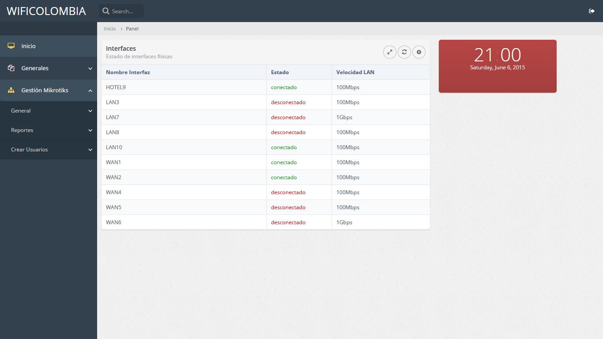
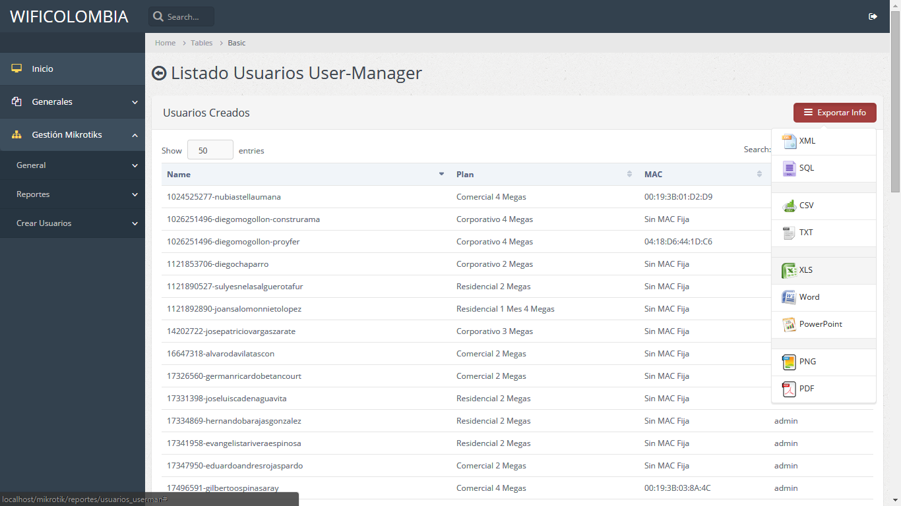
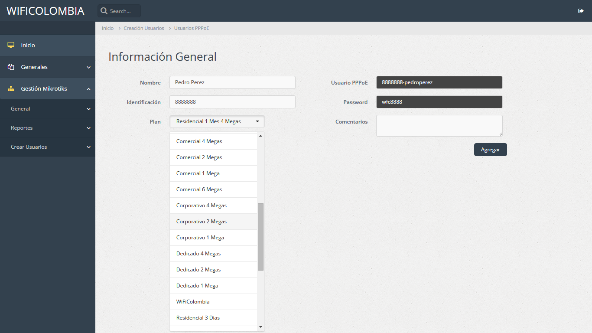

# Mikrotik PHP management system

Mikrotik RouterBoard control system from PHP.

The includes directory must be placed in the root (C: \ WAMP on Windows with WAMP Server or / var / on linux).

Functional Reports module (Userman User List, Active Hotspot, Address List and Simple Queue) with respective capacity for export in CSV, XLS, PDF and others. Interprets data from bps and displays it in Mbps for easy use.

Functional user creation module (by means of Simple Queue and Usermanager with profile assignment) Creation by Simple Queue performs automatic calculation, only the download rate in Kbps must be entered and according to the segment the system assigns priority and rate of upload (for example 1024k in dedicated segment has priority 1 and 1024k upload, while a residential has 1024k in priority 8 with 256k upload). Both Usermanager and Simple Queue have verification (If user already exists, do not create it) in the case of Queue through IP and in usermanager through user The Usermanager module automatically creates the username and password taking the customer data entered in the form.

Functional general status (interfaces and device health).

It integrates with database and access control through PHP - MySQL, integrated in includes directory.

#Screenshots

Login

Home

Interfaces

General

Users Usermanager

New User - Usermanager - PPPoE Hotspot

New user Queue with IP validation

